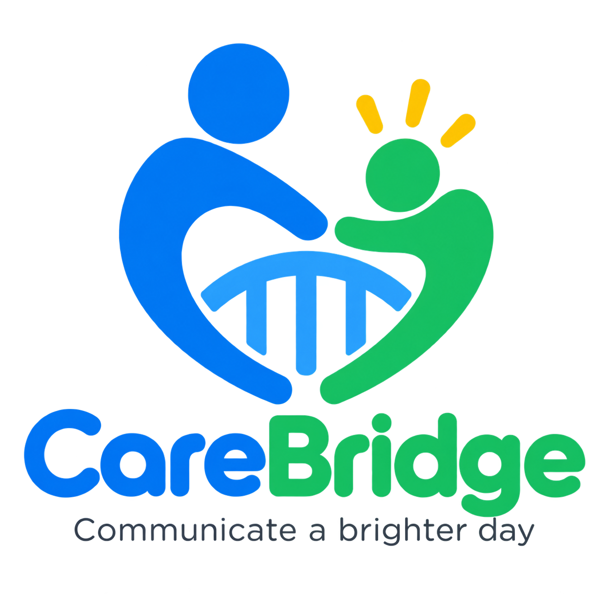

<p align="center">
  
</p>

<p align="center">
  <a href="https://github.com/quangshuynh/carebridge/actions/workflows/ci.yml">
    
  </a>
  <a href="https://flutter.dev/">
    
  </a>
  <a href="https://dart.dev/">
    
  </a>
  <a href="LICENSE">
    
  </a>
</p>

# CareBridge

CareBridge is an early-stage, local-first communication app that helps nonverbal people express familiar everyday wants, needs, and routines to caregivers through large visual choices and spoken phrases.

The current vertical slice provides six sample choices—Food, Drink, Drive, Help, Rest, and Finished. Selecting one gives immediate visual confirmation and uses on-device text-to-speech. No account or internet connection is needed for communication.

## Status and platforms

CareBridge is a small foundation intended for real-world usability testing, not production use. Android, iOS, and iPadOS are first-class targets. Physical-device accessibility and speech testing is still required.

CareBridge is not a diagnostic tool, medical device, treatment, intent-inference system, or replacement for professional AAC assessment. A selection communicates only its caregiver-configured phrase.

## Privacy and local-first design

Core communication must remain available offline and on the device. There is no authentication, cloud synchronization, analytics, advertising, or AI. Selection events exist only in memory for the running session; durable local persistence is deliberately deferred until its data lifecycle and caregiver controls are designed.

## Development and testing

Install the current stable [Flutter SDK](https://docs.flutter.dev/get-started/install), then run `flutter pub get` and `flutter run`.

```sh
dart format --output=none --set-exit-if-changed .
flutter analyze
flutter test
flutter build apk --debug
```

## Architecture

Domain models hold profiles, categories, choices, visuals, ordering, enabled state, and communication events. A small controller owns interaction state and guards rapid duplicate activation. Presentation widgets render that state. Text-to-speech sits behind a narrow interface so tests and future platform behavior stay independent of the UI.

## Caregiver editing direction

Editing is intentionally absent from the communicator board. A later caregiver mode should require a deliberate long-press followed by a caregiver-controlled PIN or device authentication, live in a separate route, and return explicitly to a locked communicator mode.

## Contributing

Issues and focused pull requests are welcome. Prioritize observable communicator needs, offline reliability, accessibility, and the smallest testable change. See [CONTRIBUTING.md](CONTRIBUTING.md).
