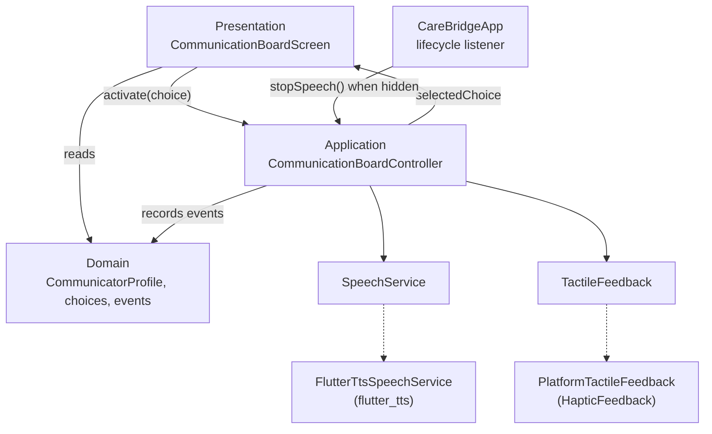

# Architecture

CareBridge is a small Flutter app with four layers. It has no backend and no cloud components. This page describes the code as it exists today.

| Folder | Role |
| --- | --- |
| `lib/domain/` | Plain data: profiles, categories, choices, visuals, and events. |
| `lib/application/` | The controller that owns interaction state. |
| `lib/presentation/` | Widgets, layout, and theme. |
| `lib/services/` | Interfaces for speech and tactile feedback. |
| `lib/infrastructure/` | Platform implementations of those interfaces. |

## Domain data

Everything the board shows is data, not widget state:

- `CommunicatorProfile` holds a display name and a list of categories.
- `CommunicationCategory` has a label, an order, an enabled flag, and its choices.
- `CommunicationChoice` has an id, a label, a spoken phrase, a visual, an order, and an enabled flag.
- `ChoiceVisual` currently holds an icon and a background color.
- `CommunicationEvent` records a choice id, its phrase, and when it occurred.

The board shows `enabledChoices`: the enabled choices of enabled categories. Categories appear in list order, and choices within a category are sorted by their `order`. The six sample choices are defined in `lib/domain/sample_board.dart` as a single category.

Keeping this as data leaves room for future caregiver customization without changing how the board works.

## Controller

`CommunicationBoardController` is a `ChangeNotifier` that owns the current selection and the session's events. When a choice is activated it:

1. ignores disabled choices and same-choice repeats within the 600 millisecond window,
2. updates the selection, records an event, and notifies listeners so the visual confirmation renders,
3. starts the haptic acknowledgment without waiting for it,
4. asks the speech service to speak the phrase.

Failures in speech or haptics are caught and ignored, so they cannot undo or delay the visual confirmation. The clock and the duplicate window can be injected, which keeps tests deterministic.

## Presentation

`CommunicationBoardScreen` listens to the controller and lays out the confirmation and the grid.

- `BoardGridLayout` calculates the column count and cell size that give the largest cells for the available area, and decides whether the grid must scroll.
- `CommunicationChoiceCard` renders one choice with its semantics.
- `CommunicationConfirmation` renders the fixed-size confirmation area.
- `FittedText` sizes text to the user's text scale, then shrinks it to fit without splitting words.

## Speech boundary

`SpeechService` is a two-method interface: `speak` replaces any current or pending speech, and `stop` discards it.

`FlutterTtsSpeechService` implements it with `flutter_tts`. It configures the voice lazily on first use, tracks a request counter so a superseded phrase is never spoken late, and stops current speech before each new phrase. Each configuration step is optional.

## Haptic boundary

`TactileFeedback` has one method, `acknowledge`. `PlatformTactileFeedback` implements it as a single light impact through Flutter's `HapticFeedback`. The device's own settings decide whether it is felt.

## Lifecycle handling

`CareBridgeApp` creates the controller and registers an `AppLifecycleListener`. When the app is hidden, it calls `stopSpeech()`, which stops speech without changing the selection.

`main.dart` awaits nothing before the first frame. Speech configures itself on first use, so the board never waits for a voice.

## Tests

Tests live in `test/` and mirror these layers. Fakes for speech and tactile feedback are in `test/support/`. The tests cover domain ordering and enabled state, duplicate activation, speech and haptic failures, speech replacement, lifecycle behavior, semantics, and phone and tablet layouts at several text scales.
