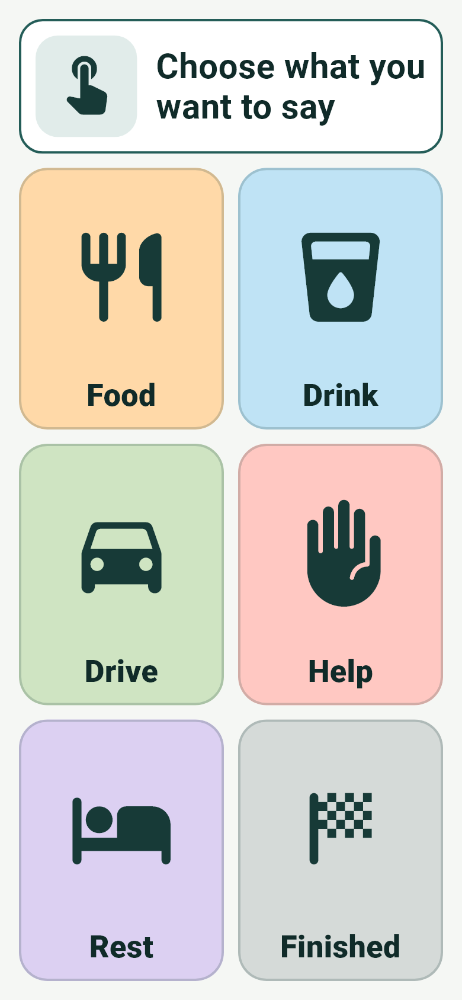
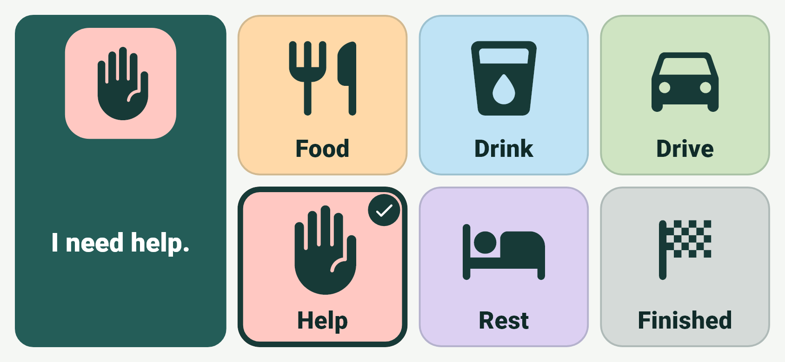
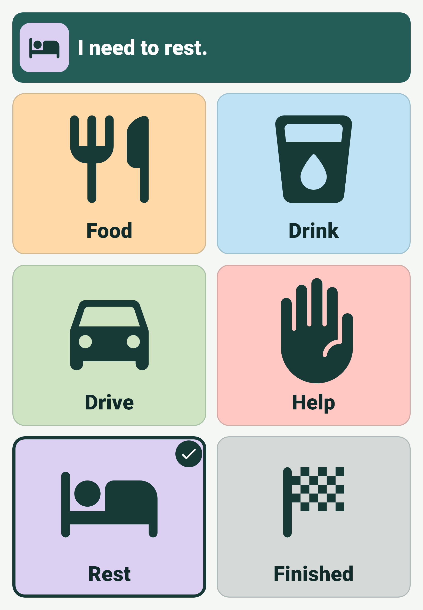

# Communicator board

The communicator board is the only screen in CareBridge today. It opens directly when the app starts. Nothing waits for speech, an account, or a network connection.

<figure markdown>

</figure>

<figure markdown>

</figure>

## Sample choices

The board currently shows six bundled sample choices:

| Choice   | Spoken phrase                    |
| -------- | -------------------------------- |
| Food     | I would like something to eat.   |
| Drink    | I would like a drink.            |
| Drive    | I want to go for a drive.        |
| Help     | I need help.                     |
| Rest     | I need to rest.                  |
| Finished | I am finished.                   |

!!! info "Demo content"
    These choices, pictures, and phrases are placeholders for development and testing. They are not personalized. Choosing a person's own words, pictures, and order is planned caregiver work that does not exist yet.

Each choice uses a standard Material icon alongside its text label. The icons have not been validated with any particular communicator.

## Selecting a choice

One tap on a choice does the following, in this order:

1. **Visual confirmation.** The choice gets a thick dark border and a check badge. The confirmation area shows the choice's picture and phrase on a dark teal background. This appears immediately and does not wait for anything else.
2. **Haptic acknowledgment.** The device gives one light tap if it supports haptics and its vibration or touch feedback settings allow it.
3. **Speech.** The phrase is spoken with the device's text-to-speech engine.

Speech and haptics are supplementary. If either fails or is unavailable, the selection still appears and stays visible.

The selection persists until another choice is selected. There is no timeout.

## Repeated taps

A second activation of the **same** choice within 600 milliseconds is ignored. It produces no new speech, haptic tap, or event. This absorbs accidental double taps.

A deliberate repeat after 600 milliseconds is accepted normally.

A **different** choice is always accepted at once, however quickly it follows the previous one.

## Speech behavior

- A new selection replaces any phrase that is still speaking. Phrases never queue up behind each other.
- A phrase that has not started yet when a newer selection arrives is discarded, so an old phrase is never spoken late.
- Voice settings are applied on the first selection, not at startup. Speech uses US English at a slightly slower rate. If a setting cannot be applied, the platform's default voice is used.
- On iPhone and iPad, speech uses the playback audio category. It stays audible with the silent switch on, and other audio is lowered briefly rather than stopped.

## Leaving the app

When CareBridge is hidden (for example, sent to the home screen, shown in the app switcher, or the device locks), any speech stops. Returning to the app shows the same selection. The old phrase is not replayed or resumed.

Brief interruptions that do not hide the app, such as pulling down the notification shade, do not stop speech.

## Layout

Every choice is visible at once. The grid picks the column count that makes the choices as large as possible for the available space, so a tall phone shows two columns of three and a wide screen shows three columns of two.

<figure markdown>

</figure>

<figure markdown>

</figure>

- **Confirmation placement.** The confirmation sits in a fixed band above the choices. On short landscape screens (less than 560 logical pixels of usable height) it moves to a panel beside them, leaving the full height for the choices.
- **Fixed size.** The confirmation area's size depends only on the screen, never on the phrase. A long phrase shrinks to fit rather than pushing the choices.
- **Not an overlay.** Confirmation is never a dialog or popup. The next choice can be tapped immediately.
- **Scrolling.** The board does not scroll when the choices fit. Only in an unusually small window, where choices would fall below 110 logical pixels, does the grid keep that minimum size and scroll.
- **Orientation.** Portrait and landscape are both supported on phones and tablets.

## No controls on the board

The board has no settings, editing, menus, or navigation. Nothing on it can change the choices.

Edge gestures such as the Android back gesture or the iOS home indicator are not blocked. Caregivers who want to keep the app on screen during a session can use Android app pinning or iOS Guided Access.

## Communication events

Each accepted selection is recorded as an event with the choice, its phrase, and the time. Events exist only in memory for the running session. They are not displayed, saved, or sent anywhere, and they are lost when the app closes. See [Privacy](privacy.md).

## Planned direction

Caregiver editing is intentionally absent from the board. The current direction is a separate caregiver mode that requires a deliberate long press followed by a caregiver-controlled PIN or device authentication, and returns explicitly to a locked communicator mode. None of this is built yet.
