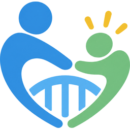
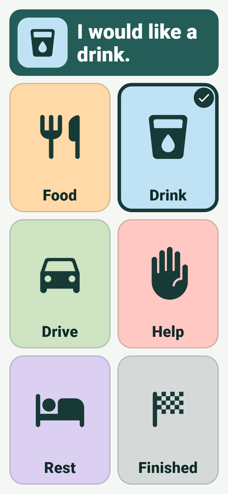
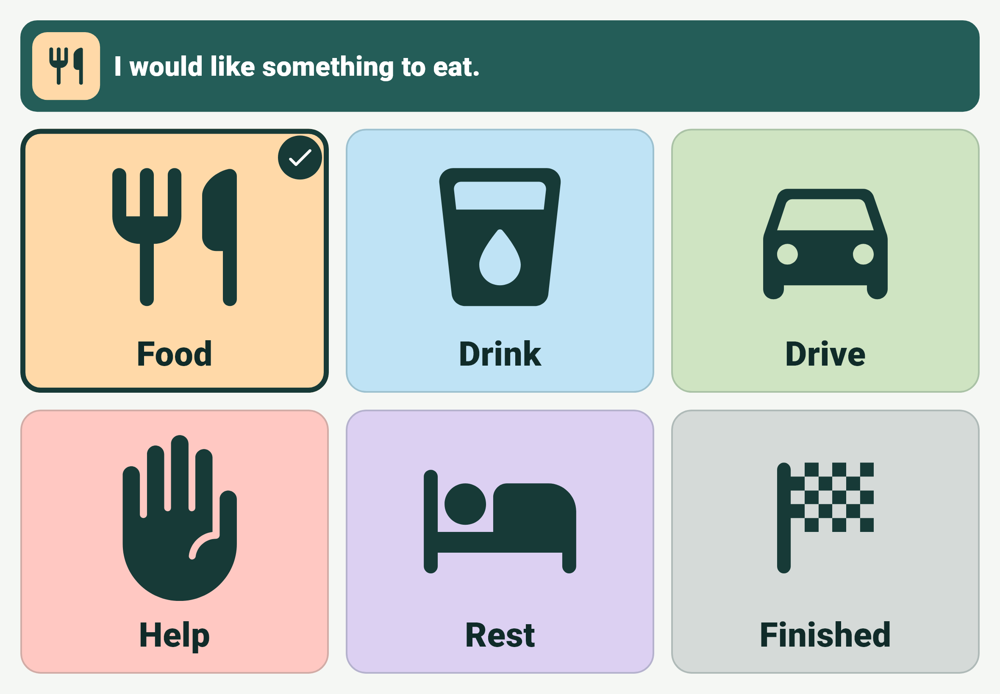

---
hide:
  - navigation
---

{ width="132" }

# CareBridge

A local-first communication board that helps nonverbal people express familiar everyday wants, needs, and routines to caregivers through large visual choices and spoken phrases.

<figure markdown>

</figure>

<figure markdown>

</figure>

## Why CareBridge exists

Many people who do not use speech still have clear everyday things to say: they are hungry, they want to go out, they need help, they are done. CareBridge aims to make those messages quick to express and easy for a caregiver to understand, using pictures, words, and a spoken phrase together.

The app is built around a few commitments:

- **Communication works offline.** No account, network connection, or setup stands between the person and their words.
- **Data stays on the device.** CareBridge has no cloud service, analytics, or advertising.
- **Targets are large and stay still.** Every choice is visible at once, and confirmation never covers or moves the choices.
- **A selection means only its phrase.** CareBridge does not guess intent, diagnose, or make medical claims.

## Current status

CareBridge is an early foundation prepared for real-world usability testing. It is not ready for production use.

Android, iOS, and iPadOS are the supported targets. The app builds for all three in CI, but physical-device testing of accessibility, speech, and haptics is still outstanding. See [Device validation](device-validation.md).

### What works today

- One board with six bundled sample choices: Food, Drink, Drive, Help, Rest, and Finished.
- One tap shows the selection with a border and check, displays the picture and phrase in a fixed confirmation area, speaks the phrase, and gives a light haptic tap where supported.
- A rapid repeat on the same choice is ignored. A different choice is accepted at once.
- Layouts for phones and tablets in portrait and landscape, with system text scaling.
- Screen-reader semantics for every choice and for the confirmation.

Read the full behavior in [Communicator board](communicator-board.md).

### Not yet built

These are deliberately absent today:

- Personalized choices, pictures, or phrases. The six choices are demo content.
- Caregiver editing.
- Saving anything between sessions.
- Accounts, cloud sync, or multiple devices.

## What CareBridge is not

CareBridge is not a medical device, diagnostic tool, or treatment. It does not replace professional AAC (augmentative and alternative communication) assessment and cannot guarantee communication. It has not yet been validated with any particular communicator.

## Next steps

-   :material-rocket-launch-outline: **[Getting started](getting-started.md)**

    Set up Flutter, run the app, and deploy to a phone or tablet.

-   :material-gesture-tap: **[Communicator board](communicator-board.md)**

    Exactly what happens when someone taps a choice.

-   :material-human: **[Accessibility](accessibility.md)**

    Target size, text scaling, screen readers, and layout decisions.

-   :material-shield-lock-outline: **[Privacy](privacy.md)**

    What stays on the device and what the operating system handles.

-   :material-sitemap-outline: **[Architecture](architecture.md)**

    Domain data, the controller, and the speech and haptic boundaries.

-   :material-clipboard-check-outline: **[Device validation](device-validation.md)**

    The checklist for testing CareBridge on real devices.

